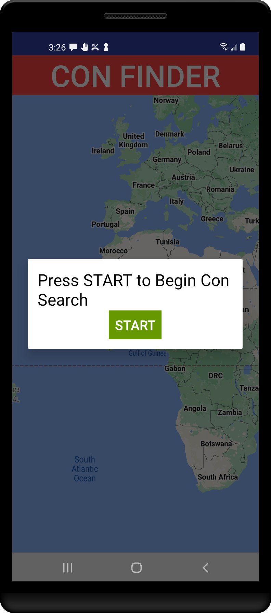
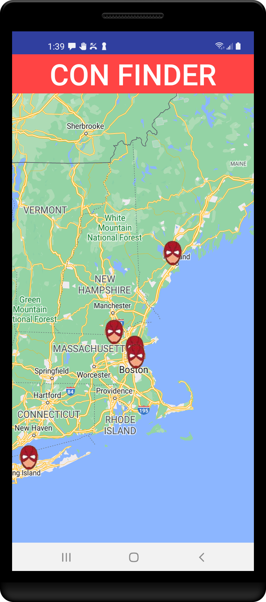

 

## ConFinder for Android

Originally coded in 2017, this is a demo app for using the Google Maps API. It locates up-coming Comic-Cons and displays them on a map. Because who doesn't like a Comic-Con?

In this repo you'll find:
*   Image loading with Android's **[Google Maps](https://developers.google.com/maps/documentation/android-sdk/start)** API.
*   A single-activity architecture employing the **[Model-View-Presenter](https://www.raywenderlich.com/7026-getting-started-with-mvp-model-view-presenter-on-android)** design pattern.
*   Consumption of a remote XML API, using Square's **[Retrofit2](https://square.github.io/retrofit/)** library coupled with regular Java XML parsing.

### Screen Shots

<tr>
<td>

</td>
<td>

</td>
</tr>

### Running the app in Android Studio

In order to run the code, you need a Google Maps API key.

To get one, follow the directions here:

https://developers.google.com/maps/documentation/android-sdk/get-api-key
